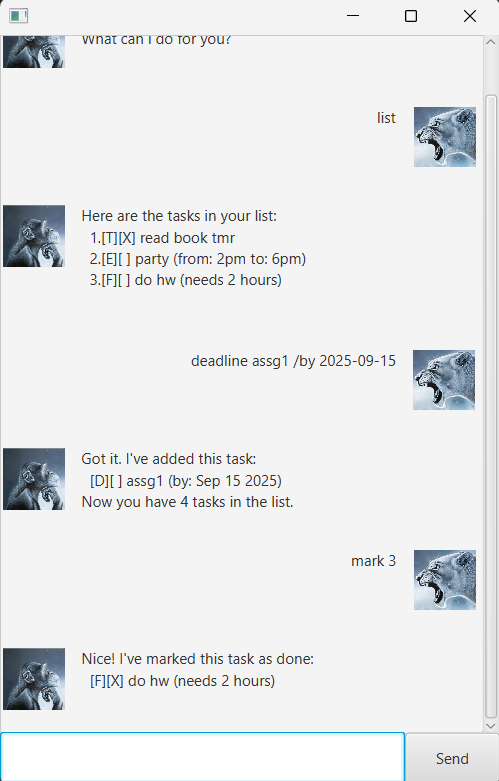

# Sheares User Guide



Sheares is a chatbot designed to help you manage your tasks more effectively.  
This app has both CLI and GUI versions.  
To exit the chatbot, input the "bye" command (works for both)  
For GUI, clicking the "X" icon is an alternative.

## Feature 1: Adding tasks
### ToDo Tasks

Adds a task with just a basic description  
Command format is todo "description".

Example: `todo read books`

Expected outcome is as below:

```
todo borrow book
    ____________________________________________________________
     Got it. I've added this task:
       [T][ ] borrow book
     Now you have 1 tasks in the list.
    ____________________________________________________________
```

### Deadlines

Adds a task with a basic description and a deadline   
Command format is deadline "description" /by "deadline"  
Do note that deadline must be in the format "YYYY-MM-DD"

Example: `deadline return book /by 2025-09-16`

Expected outcome is as below:

```
deadline return book /by 2025-09-16
    ____________________________________________________________
     Got it. I've added this task:
       [D][ ] return book (by: Sep 16 2025)
     Now you have 2 tasks in the list.
    ____________________________________________________________
```

### Events

Adds a task with a basic description, and a start + end date   
Command format is event "description" /from "start" /to "end"  

Example: `event project meeting /from Mon 2pm /to 4pm`

Expected outcome is as below:

```
event project meeting /from Mon 2pm /to 4pm
    ____________________________________________________________
     Got it. I've added this task:
       [E][ ] project meeting (from: Mon 2pm to: 4pm)
     Now you have 3 tasks in the list.
    ____________________________________________________________
```

### FixedDuration Tasks

Adds a task with a basic description, and the duration needed to finish it   
Command format is fixed "description" /duration "time"

Example: `fixed do hw /duration 2 hours`

Expected outcome is as below:

```
fixed do hw /duration 2 hours
    ____________________________________________________________
     Got it. I've added this task:
       [F][ ] do hw (needs 2 hours)
     Now you have 4 tasks in the list.
    ____________________________________________________________
```

## Feature 2: Mark / Unmark tasks
Freely update the status of your tasks.  
Command format is mark/unmark "task number"  
Do note that 1-index is being used.  
E.g marking first task would be mark 1  
Marking a done task, or unmarking an undone task will have no effect

Expected outcome is as below:
 ```
 list
    ____________________________________________________________
     Here are the tasks in your list:
     1.[T][X] read book
     2.[T][ ] return book
     3.[T][ ] buy bread
    ____________________________________________________________
    
 mark 2
    ____________________________________________________________
     Nice! I've marked this task as done:
       [T][X] return book
    ____________________________________________________________

unmark 2
    ____________________________________________________________
     OK, I've marked this task as not done yet:
       [T][ ] return book
    ____________________________________________________________
 ```

## Feature 3: Listing

Lists out all the tasks that the user is storing.  
Command format is just list

Expected outcome is as below: 
```
list
    ____________________________________________________________
     Here are the tasks in your list:
     1.[T][X] read book
     2.[T][ ] return book
     3.[T][ ] buy bread
    ____________________________________________________________
```


## Feature 4: Delete tasks

Deletes a selected task (will no longer be tracked)  
Command format is delete "task_number"  
1-based indexing

Expected output is as below:
```
list
    ____________________________________________________________
     Here are the tasks in your list:
     1.[T][X] read book
     2.[D][X] return book (by: June 6 2025)
     3.[E][ ] project meeting (from: Aug 6th 2pm to: 4pm)
     4.[T][X] join sports club
     5.[T][ ] borrow book
    ____________________________________________________________

delete 3
    ____________________________________________________________
     Noted. I've removed this task:
       [E][ ] project meeting (from: Aug 6th 2pm to: 4pm)
     Now you have 4 tasks in the list.
    ____________________________________________________________

```

## Feature 5: Find tasks

Find a task by searching for a keyword in the task description  
All tasks that match this keyword will be listed out  
Command format is find "keyword"  

Expected output is as below:  
```
find book
    ____________________________________________________________
     Here are the matching tasks in your list:
     1.[T][X] read book
     2.[D][X] return book (by: June 6 2025)
    ____________________________________________________________

```

## Feature 6: Auto-save

The chatbot is able to auto-save any changes to the existing tasks.  
This ensures the user's progress is being saved at all times, even across sessions.  
